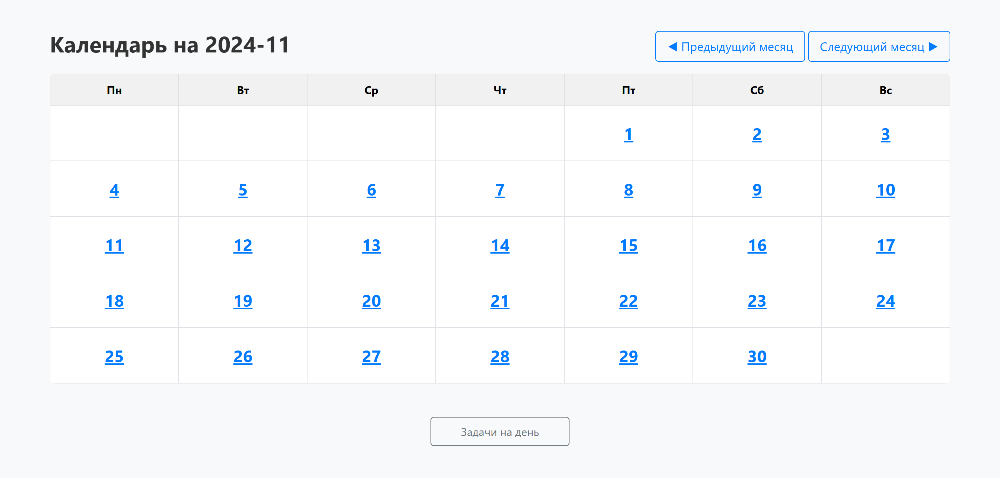

# Веб-приложение для ведения дневника и планирования задач

## Описание проекта
Данный проект представляет собой клиент-серверное веб-приложение для ведения дневника и планирования задач на день. Оно объединяет функционал личного дневника и планировщика задач, а также поддерживает метки важности, что позволяет эффективно фильтровать и приоритизировать информацию, и ведёт статистику.

## Цель работы
Разработка и обоснование архитектуры клиент-серверного приложения для ведения дневника и планирования задач на день.

## Исследование
В ходе работы был проведён анализ популярных приложений для ведения дневника и планирования задач, изучены современные подходы к проектированию и архитектурные стили. Выявлены эффективные решения, которые были реализованы в данном приложении.

## Функционал
- Регистрация и авторизация пользователей.
- Ведение дневника и планирование задач.
- Система поиска записей.
- Метки важности для фильтрации записей.
- Интеграция статистики для отслеживания выполнения задач.

## Нефункциональные требования
- Удобный интерфейс: интуитивно понятный для пользователей разных возрастов и уровней подготовки.
- Высокая производительность: пагинация, AJAX-запросы.
- Безопасность: защита данных пользователей (шифрование, защита от SQL-инъекций).
- Тестируемость: удобное тестирование на всех уровнях.

## Стек технологий
- Backend: Java, Spring Boot.
- Frontend: HTML, Thymeleaf, JavaScript, CSS, Bootstrap.
- Database: PostgreSQL.
- DevOps: Docker.

## Пользовательский интерфейс
### Форма авторизации:

### Страница записей пользователя:

### Страница создания записи:

### Страница редактирования записи:

### Страница поиска записей:

### Страница задач на день:

### Страница календарь:

## Контакты
Автор: Михалькевич Владислав 
Email: Mihalkevitc.23V@yandex.ru

Если вам понравился проект, не забудьте поставить звезду!
